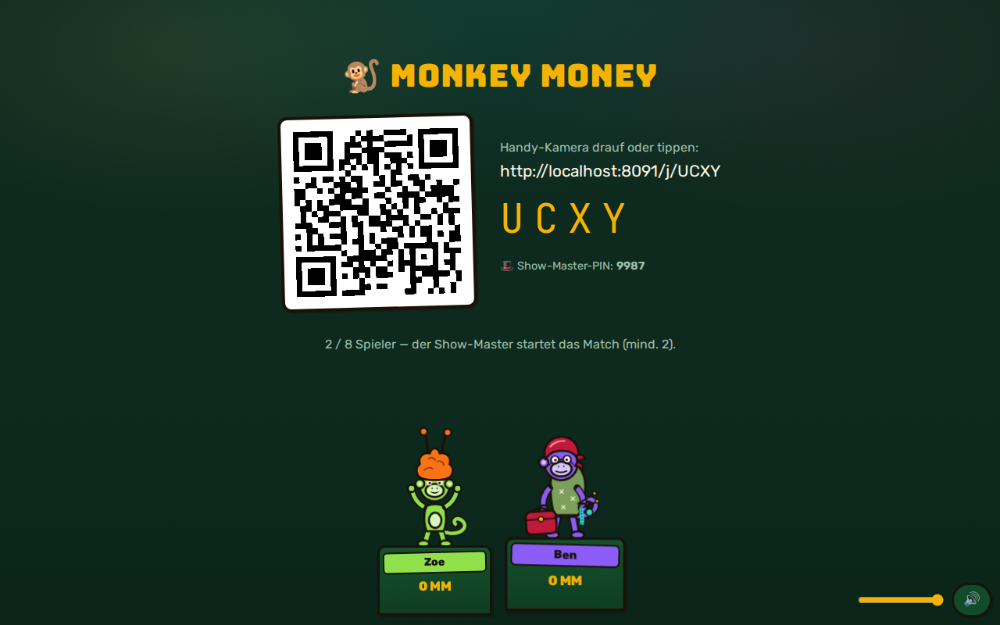
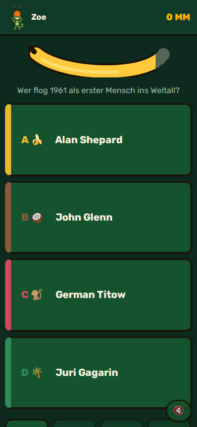
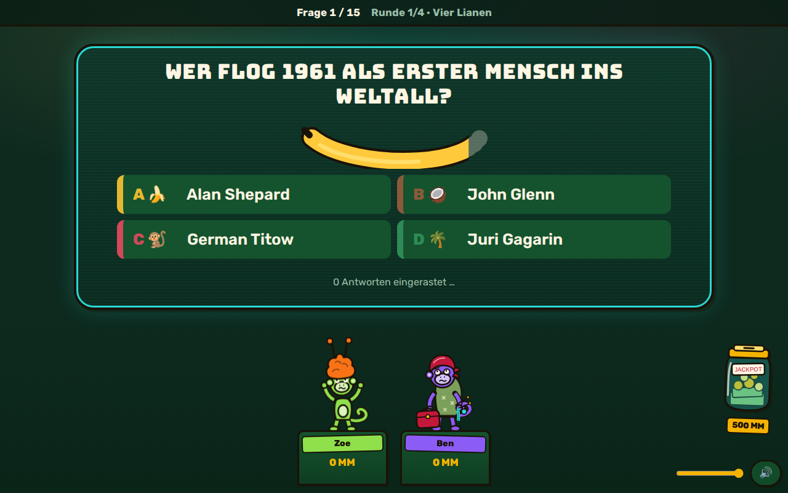
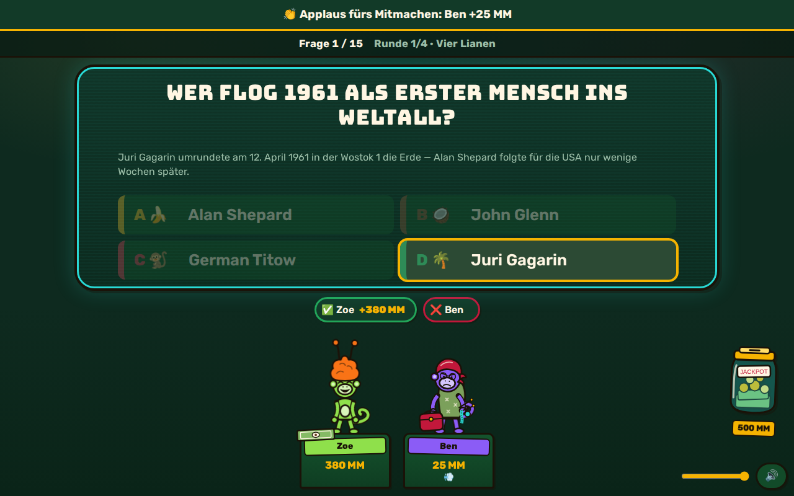
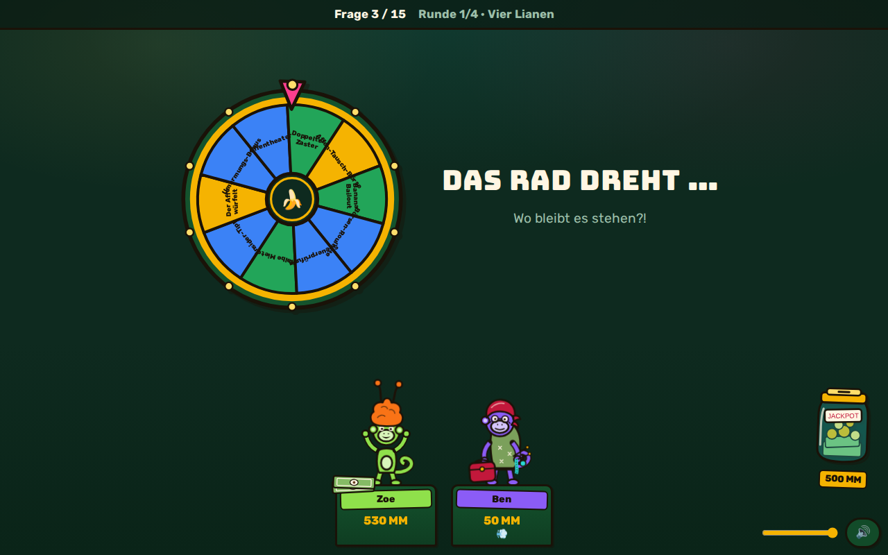
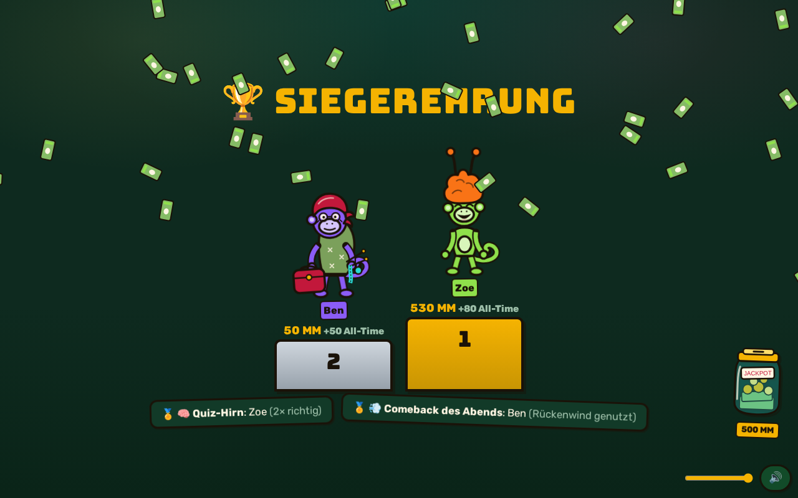

# 🐒 MONKEY MONEY

**Die Quiz-Show fürs Wohnzimmer.** Ein iPad (oder Beamer-PC) ist die Bühne,
die iPhones der Gäste sind die Buzzer, ein Show-Master dirigiert — Jackbox
trifft Buzz!, mit Bananen-Währung. Alles läuft über einen einzigen
Node-Server im LAN oder hinter einem Cloudflare-Tunnel; niemand installiert
etwas, gejoint wird per QR-Code in Safari.

> Verbindliche Grundlagen: `docs/TECH-SPEC.md` (Technik) und
> `docs/GAME-DESIGN.md` (Spielregeln). Wie man als Entwickler andockt:
> `docs/ARCHITEKTUR.md`.

## Features

- **Komplette Show-Dramaturgie:** Lobby → Opening mit 3D-Logo-Stinger →
  Runden (Kategorien-Voting, Erklärkarten, Fragen, Zwischenstand, Glücksrad)
  → Jackpot → Finale → Siegerehrung mit Awards + Replay-Highlights.
- **21 Minispiel-Formate** auf einem eingefrorenen Plugin-Vertrag:
  Bananen-Basics (Warm-up), Vier Lianen, Kokosnuss-Uhr, Bananen-Tresor
  (Schätzen), Affenleiter (Sortieren), Pixel-Dschungel (Bild-Enthüllung),
  Affenbank (BANK!-Verrat), Stinkbanane (Pass-the-Bomb), Taschendieb-Affe
  (Buzzer-Klau), Alles-oder-Banane (Geheim-Einsatz), Monkey Market
  (Chip-Handel), Bananen-Bluff, Bananen-Börse, Affen-Auktion, Duell am
  Lianensteg (1v1 + Wetten), Der Goldene Affe (3-Stufen-Finale) — plus
  Lianen-Finale und **4 Musik-Formate**: Blitz-DJ (Buzz-Treppe),
  Rückwärts-Banane, Stummfilm-Studio (Musikvideo ohne Ton),
  7-Buchstaben-Telegramm.
- **Musik-System:** Song-Pack-Pipeline mit 1-Zeilen-Import (yt-dlp +
  ffmpeg-Snippets + −16-LUFS-Normalisierung, `docs/MUSIK-PACKS.md`) —
  Starter-Pack mit 19 echten Songs.
- **Money-Ökonomie** mit Streaks, Speed-Bonus, Jackpot-Glas, Rückenwind und
  Finale-Aufholformel — alles serverseitig, deterministisch, getestet.
- **Team-Modus:** 2er/2v2v2v2/frei mit Stärke-Snake-Draft, Team-Töpfen,
  Team-Podest und AT-Team-Bonus.
- **7 Joker** (Bananen-Split, Rückgaberecht, Schmiergeld, …) + **Glücksrad**
  mit 14 Segmenten und Pity-Timer.
- **GM-Cockpit** mit 17 Werkzeugen: Spickzettel, Fragen-Regal, Punkte±,
  Flüster-Tipp, Votings, Bestrafungen/Boosts, Bananen-Pause, Auto-GM.
- **Reconnect als Normalfall:** Session-Token + Snapshot/seq-Protokoll —
  gesperrtes Handy entsperren und weiterspielen, Grace-Period 180 s.
- **Buzzer-Fairness:** Median-RTT-Kompensation mit hartem Clamp,
  280-ms-Sammel-Fenster, Fotofinish-Los bei < 24 ms.
- **6.485 validierte Fragen** (davon ~5.000 kreuzgeprüft) in 248 Packs
  (14 Ober-/90 Unter-Kategorien, 8 Frage-Typen, 4 Schwierigkeiten inkl.
  ULTRAHARD, 14-Regeln-Validator in der CI) — inklusive Bilderrätsel für den
  Pixel-Dschungel.
- **Meta-Systeme:** Profile ohne Account (PIN optional,
  Geräte-Wiedererkennung), All-Time-Bestenlisten, Shop mit 51 Items,
  Level-System + Bananen-Pass (30 Stufen) + Quests, Übungsmodus
  (Spaced-Repetition), Save/Load-Slots, Admin-Analytics.
- **Standalone-Host:** der komplette Spiel-Server läuft im Browser des iPads
  (`/host`) — Telefone verbinden sich über das Relay der iPad-App, kein PC
  nötig; IndexedDB persistiert das Event-Log.
- **Lobby-Browser:** öffentliche Lobbys (Opt-in) live auf der Landing +
  „Schnell beitreten" in die vollste offene Lobby.
- **14 Affen-Puppen** als Gelenk-SVGs mit Palette-Swap und
  Shop-Accessoires — plus Erklär-Demos, in denen 2 Puppen jede Mechanik
  vorspielen.
- **Bot-Framework:** headless Bots spielen komplette Matches gegen den echten
  Server — inklusive Chaos-Modus (Random-Disconnects) als CI-Gate.

## Trailer

**[▶ Trailer ansehen (72 s, 1080p)](assets/video/trailer.mp4)** — gerendert
mit Remotion aus echten Gameplay-Screens (`remotion/`), Musik: Kevin MacLeod
(CC BY 4.0). Dazu: 3D-Logo-Stinger (`assets/video/logo_stinger.webm`, VP9 mit
Alpha — läuft im Show-Opening) und **21 Tutorial-Videos** — eins pro Format
(`assets/video/tutorial_*.mp4`, zuschaltbar über das Match-Setting
`tutorialVideos`).

## Screenshots

| Bühne                                                              |                                          Handy                                           |
| ------------------------------------------------------------------ | :--------------------------------------------------------------------------------------: |
|          |  |
|    |                                                                                          |
|  |                                                                                          |
|          |                                                                                          |
|    |                                                                                          |

## Quickstart

Voraussetzung: Node ≥ 20.

```bash
npm ci
npm run build     # Vite-Clients → client/dist + Server-Bundle → server/dist
npm start         # Server auf http://localhost:8080 (PORT via Env)
```

Dann: Bildschirm auf `http://<lan-ip>:8080/` öffnen, iPhones scannen den
QR-Code, Show-Master geht auf `/gm` (PIN steht auf dem Bildschirm).

Ausführliche Anleitungen:

- **PC + WLAN (+ Cloudflare-Tunnel):** `docs/DEPLOY-PC.md`
- **AMP-Server (HTTP-Pfad):** `docs/DEPLOY-AMP.md`
- **iPad einrichten (.ipa-Sideload oder Safari):** `docs/IPAD-SETUP.md`

## Die Rollen

| Rolle           | Gerät             | Aufgabe                                                                        |
| --------------- | ----------------- | ------------------------------------------------------------------------------ |
| **Bildschirm**  | iPad / Beamer-PC  | Die Bühne: Lobby mit QR, Fragen, Scoreboard, Sound. Tokenlos, mehrfach erlaubt |
| **Spieler**     | iPhone (hochkant) | Buzzer + Antwort-Formulare — joint per QR, überlebt den Abend ohne Reload      |
| **Show-Master** | iPad / Laptop     | Regiepult mit Spickzettel und 17 Werkzeugen — geschützt per GM-PIN             |
| **Spectator**   | beliebig          | Zuschauer-Ansicht (Spät-Joiner landen hier)                                    |

## Architektur in 30 Sekunden

```
iPhones (Safari) ─┐
iPad-Bühne ───────┼── socket.io ──> Express + Engine (EIN Node-Prozess)
GM-Cockpit ───────┘                    │  Server = einzige Wahrheit
                                       │  rollen-gefilterte Views (viewFor)
                                       └─> DATA_DIR: JSON/JSONL (atomar)
```

- `shared/` — Zod-Protokoll, Views, Ökonomie, Buzzer-Fairness (beidseitig)
- `server/` — Express/socket.io-Wiring, Räume/Sessions, **pure** Engine,
  Minispiel-Plugins, Content-Loader, Event-Log
- `client/` — Vite-MPA: Landing, Bühne, Spieler, GM (Vanilla TS + lit-html)
- `content/packs/` — Fragen-Packs (validiert), `content/musik/` — Song-Packs,
  `tools/bots/` — Test-Bots
- `ios-wrapper/` — WKWebView-Wrapper fürs Gastgeber-iPad (unsignierte .ipa
  aus der CI)

Details: `docs/ARCHITEKTUR.md` · Entscheidungen: `docs/TECH-SPEC.md`.

## Entwicklung

```bash
npm run dev        # Server via tsx mit Watch (serviert client/dist — vorher 1× bauen)
npm run build      # = build:client (Vite → client/dist) + build:server (esbuild → server/dist)
npm start          # gebauten Server starten (node server/dist/index.js)
npm test           # Vitest (Engine, Protokoll, Minispiele, Storage …)
npm run lint       # Prettier-Check + ESLint (Abhängigkeitsregeln der TECH-SPEC)
npm run format     # Prettier-Write (repo-weit — vor jedem Push laufen lassen!)
npm run typecheck  # tsc --noEmit
npm run bots -- --players 3 --seed 42 --modus quick   # E2E: Bots spielen ein Match
node tools/content/validate.mjs                        # Fragen-Pack-Gate
```

Wichtige Env-Variablen: `PORT` (Default 8080), `DATA_DIR` (Default `./data`),
`MAX_ROOMS`, `FRAGEN_PRO_MATCH`.

### CI (GitHub Actions, `.github/workflows/monkey-money.yml`)

| Job                | Inhalt                                                                                                                            |
| ------------------ | --------------------------------------------------------------------------------------------------------------------------------- |
| `lint`             | Prettier-Check, ESLint, `tsc --noEmit`                                                                                            |
| `test`             | Vitest                                                                                                                            |
| `build`            | Vite + Server-Bundle → Artefakt `monkey-money-dist` (= AMP-Deploy-Inhalt inkl. `assets/` + `content/musik/`)                      |
| `content-validate` | `node tools/content/validate.mjs` (14-Regeln-Gate)                                                                                |
| `bots-e2e`         | Server starten + 3 Bots spielen ein komplettes Quick-Match (echtes E2E-Gate)                                                      |
| `ipa`              | Unsignierte iPad-.ipa (`monkey-money-unsigned-ipa`) — nur bei Änderungen an `ios-wrapper/**`/Workflow oder per Run-workflow-Knopf |

## Credits

Sounds, Musik und Fonts sind CC0/CC-BY/OFL-lizenziert und vollständig in
[`CREDITS.md`](CREDITS.md) attribuiert. Keine externen Dienste zur Laufzeit —
die Show funktioniert im WLAN ohne Internet.
